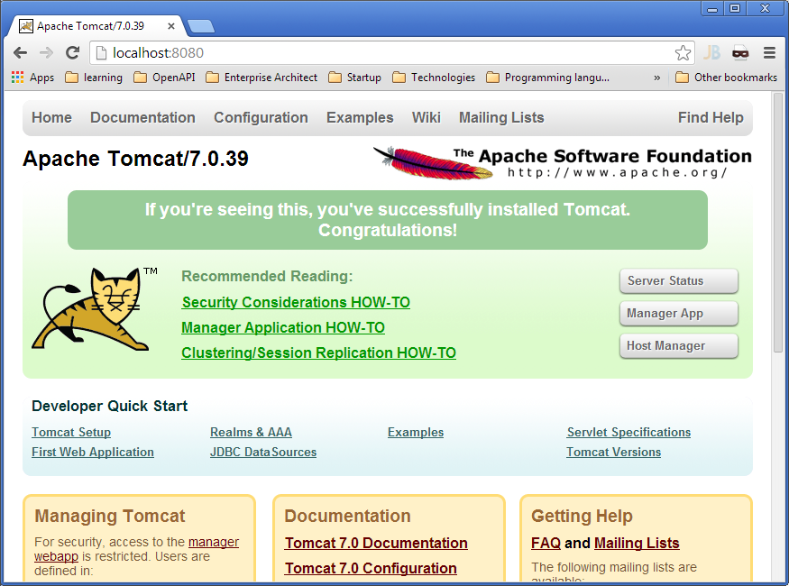
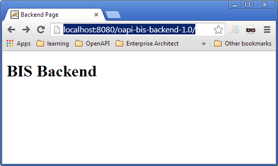
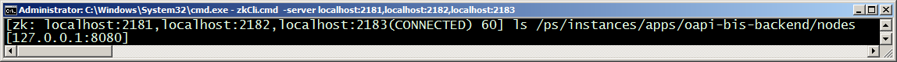
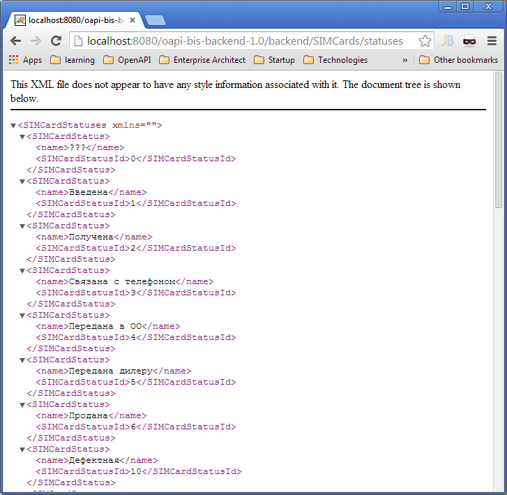
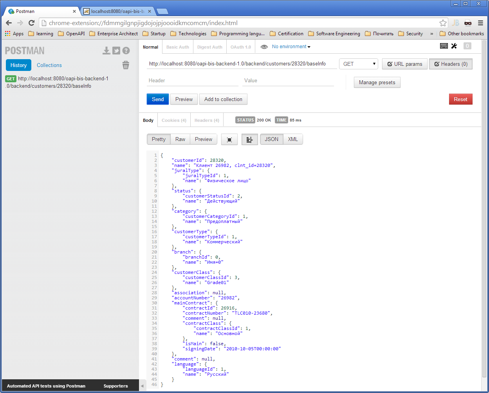
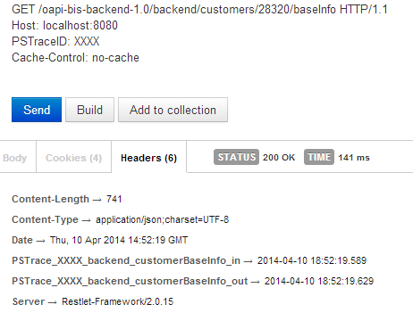
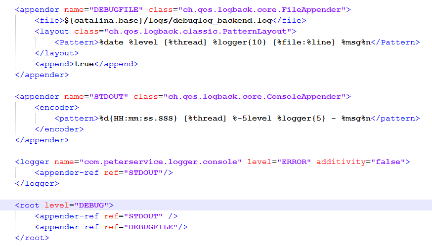
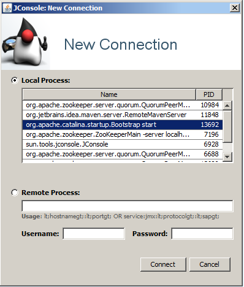
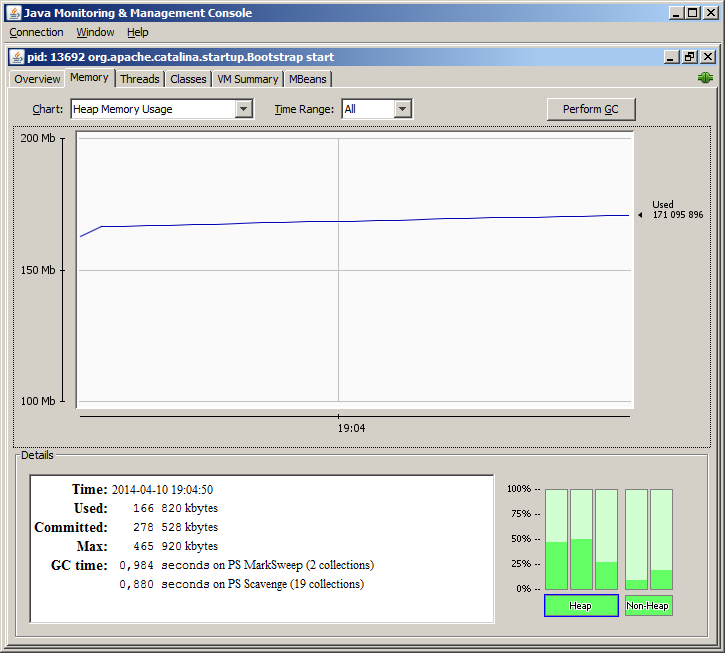
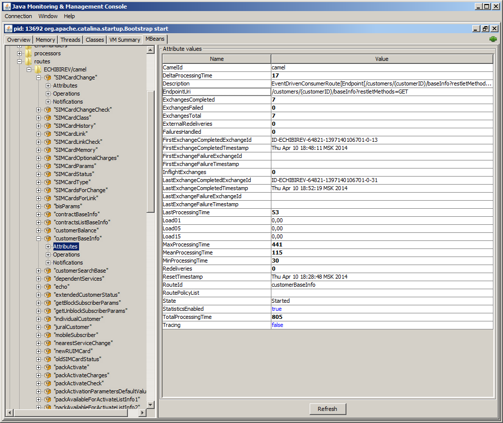

== Backend

Инфраструктура Open API выдвигает ряд требований к бэкенду (**prod**** 48350**):

* Трассировка

* Формат данных

* Регистрация модуля в Zookeeper

* Авторизация

* Работа с предикатами

В качестве примера для установки и настройки, мы будем использовать подсистему OAPI_BIS_API_BACKEND. Подсистема предоставляет доступ к функциям продукта BIS и реализована в виде Java веб приложения, работающего на сервере Tomcat. 

==== __Установка OAPI_BIS_API_BACKEND__

. Установить Tomcat сервер:
+

.. Распаковать файл **apache-tomcat-7.0.39.tar**  в любую папку (путь не должен содержать пробелов и русских букв) 
+

.. Запустить файл **bin****\startup.bat**, в случае возникновения ошибок, проверить задана ли переменная JAVA_HOME (JAVA_HOME=C:\Program Files\Java\jdk1.7.0_45)
+

.. Открыть страницу http://localhost:8080
+

. Распаковать файл oapi_bis_api_backend-usr-xxx.xx.zip и скопировать файл **oapi-bis-backend-1.0.war** в папку **webapps****/ **в Tomcat. **(При старте, ****приложение зачитает параметры подключения к БД из ****ZooKeeper****. Параметры должны быть прописаны!!!)** 

. Запустить Tomcat сервер. При старте произойдет deploy приложения и в папке webapps создастся папка oapi-bis-backend-1.0. После этого остановить сервер.

. Выполнить рад настроек приложения:
+

.. В файле webapps\oapi-bis-backend-1.0\WEB-INF\classes\**app.properties** задать параметр **secretKey****=1111** (Ключ шифрования пароля к бд, который храниться в zookeeper)
+

.. В файле webapps\oapi-bis-backend-1.0\WEB-INF\classes\**applicationCo****ntext.xml** изменить значение bean isIdmWork на **false**** **(было true)
+

[cols="1a"]
|===
|
    <bean id="isIdmWork" class="java.lang.String">
       <constructor-arg><value>false</value></constructor-arg>
    </bean>

|===

.. В файле webapps\oapi-bis-backend-1.0\WEB-INF\classes\**dbContext** изменить количество коннекций к бд - значение maxActive на **5** (было 60)
+

[cols="1a"]
|===
|
    <bean id="oraDataSource" class="org.apache.tomcat.jdbc.pool.DataSource" lazy-init="false"  destroy-method="close">
        ...
        <property name="maxActive" value="5"/>
        <property name="initialSize" value="1"/>
        <property name="validationQuery" value="select 1 from dual"/>
        <property name="validationInterval" value="10000"/>
        <property name="testOnBorrow" value="true"/>        
    </bean>

|===

. Перезапустить Tomcat. Открыть страницу http://localhost:8080/oapi-bis-backend-1.0
+

. Проверить, что приложение зарегистрировало себя в ZooKeeper:
+

. Выполнить запрос http://localhost:8080/oapi-bis-backend-1.0/backend/SIMCards/statuses
+

. Для тестирования RESTful API удобно использовать REST клиент, который позволяет указывать метод HTTP запроса, задавать заголовки и сохранять историю запросов. В качестве примера, можно использовать плагин для браузера chrome: https://chrome.google.com/webstore/detail/postman-rest-client/fdmmgilgnpjigdojojpjoooidkmcomcm или любой другой клиент.
+

. С помощью следующих запросов определить имя клиента, владеющего номером телефона 89211000300

.. http://localhost:8080/oapi-bis-backend-1.0/backend/customers/byMSISDN/{msisdn}

.. http://localhost:8080/oapi-bis-backend-1.0/backend/customers/{customerId}/baseInfo

. Согласно требованиям к бэкенду, по трассировке, при передаче в запросе заголовка PSTraceID=XXXX, в ответе должны присутствовать заголовки: PSTrace_XXXX_backend_customerBaseInfo_in и  PSTrace_XXXX_backend_customerBaseInfo_out 

==== Логирование

Логирование подсистемы OAPI_BIS_API_BACKEND настраивается в файле 

webapps\oapi-bis-backend-1.0\WEB-INF\classes\**logback.xml**

Например, для повышения уровня логирования до уровня DEBUG и включения записи в лог файл можно изменить тег <root>, следующим образом:

==== Мониторинг

. Открыть **jconsole**** **(%JAVA_HOME%\bin\jconsole.exe) 
+

. Выбрать локальный процесс Tomcat:
+

Потребление памяти Tomcat сервер:

Доступные маршруты, реализованнные с помощью фреймворка Camel (т.к. сервисы реализованы с с помощью Camel, это список доступных сервисов приложения):

